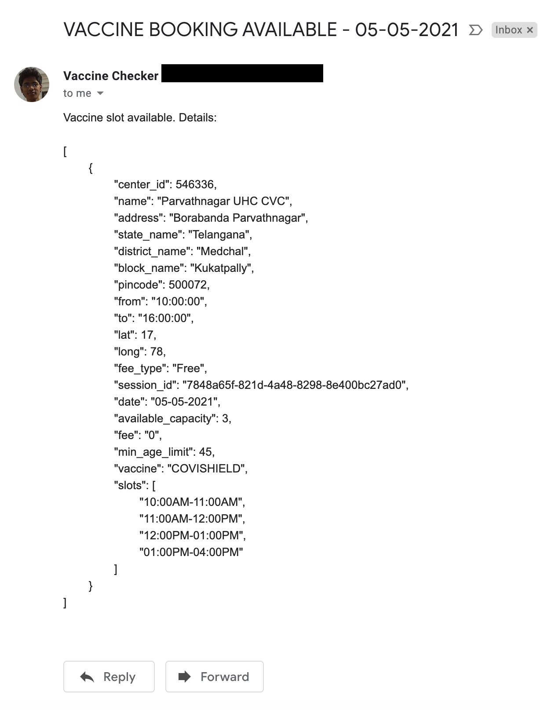

## BharatVaccineSlotNotifier
This application checks the CoWIN portal periodically to find vaccination center slots availability in your area identified by your area pin code and for your age. If found, it will send you emails every minute until the slots are available.


# Steps to run the script

- Enable application access on your gmail with steps given here: [GMAIL App Password Generation]


- Enter the details in the file .env, present in the same folder


- Run the following commands to setup and start the app:
```sh
cd BharatVaccineSlotNotifier
npm i
pm2 start vaccineNotifier.js
```


- To close the app run:
```sh
pm2 stop vaccineNotifier.js && pm2 delete vaccineNotifier.js
```


Here's a sample email:



[GMAIL App Password Generation]: <https://support.google.com/accounts/answer/185833?p=InvalidSecondFactor&visit_id=637554658548216477-2576856839&rd=1>